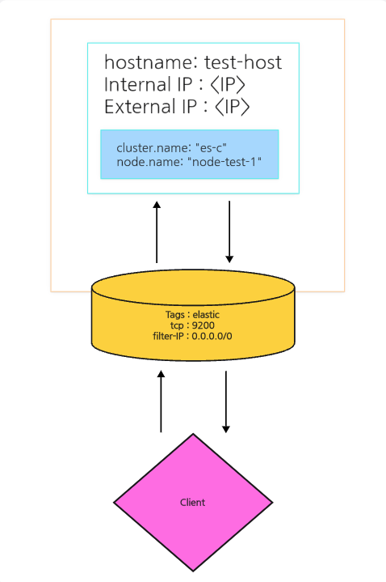
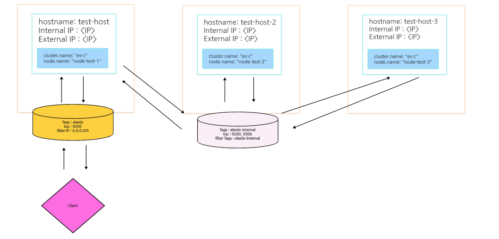
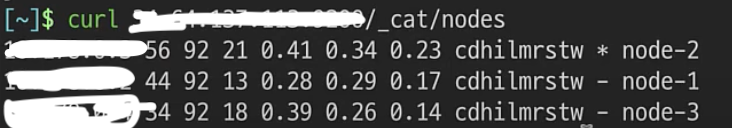

# elasticSearch

Cluster 구성하기

- 1번에서 이어지는 내용으로 1번에서 설장한 내용을 기반으로 작성이 됩니다.
- 1번에서 설정된 `elasticsearch.yml`의 형태는 다음과 같습니다.

```azure
cluster.name: "es-c"
node.name: "node-test-1"
network.host: ["_local_", "_site_"]
discover.seed_hosts: ["test-1"]
cluster.initial_master_nodes: ["node-test-1"]
```

또한 추가로 인스턴스에 방화벽에 대한 설정도 외부에서 접근 가능하게 설정을 하였고,
이러한 설정에 대한 다이어그램은 다음과 같습니다.



</br>

하지만 최종적으로 우리가 구성해야 하는 클러스터는 다음과 같습니다.



해당 과정에 대해서 다루어 보고자 합니다.

- 먼저 생성하는 인스턴스는 모두 기존과 동일하고 `elasticsearch.yml` 파일에 대해서 설정이 모두 되었다고 가정을 하겠습니다.
- 해당 아키텍처는 기본적으로 기존에 사용하던 Node와 통신을 하며, 내부적으로 `ElasticSearch` 끼리 통신을 하며 고가용성을 챙기기 위한 아키텍처입니다.

</br>

<h1> firewall 설정하기 </h1>

현재 해당 아키텍처에서 고려해야 하는 부분은 다음과 같습니다.

> node-test-1은 외부 client와 통신이 되어야 한다
>
> > 그러기 떄문에 설정 자체는 그대로 유지하면 됩니다.

> node끼리만 통신이 되어야 한다.
>
> > 그러면, tag를 서로 공유하는 방화벽 설정을 통해서 내부 인스턴스간에 통신이 공유가 되어야 합니다.

</br>

해당 설정을 하기 전에, 기본적으로 IP를 통해서 통신하기 보다는 좀 더 보안적으로 우수하게 name을 통해서 통신하게 수정하겠습니다.

`sudo vi /etc/hosts` 를 통해서 다음과 같은 항목을 모두 추가해 줍니다.

```
IP hostName1 -> 예를들면, 인스턴스명인, elastic-test-1 같은 값이 들어갑니다.
IP hostName2
IP hostName3
```

이 후 `yml` 파일을 모두 다음과 같이 수정해 줍니다.

```
discover.seed_hosts: ["hostName1", "hostName2", "hostName3"]
cluster.initial_master_nodes: ["node-test-1", "node-test-2", "node-test-3"]
```

이렇게 설정을 해주게 된다면, 서로 누가 마스터 노드인지 통신을 하며 `ElasticSearch`에서 알아서 노드를 사용하게 됩니다.

이렇게 설정이 된 상태에서 구동을 하면, 실행이 안되는 상황이 발생합니다.

왜냐하면 서로간의 통신에 대해서 방화벽이 뚫려있지 않기 때문입니다.
그래서 2번 항목을 처리해주어야, 노드들이 실행 가능한 상태로써 구동이 됩니다.

- 2번 항목은 보안 그룹에 대한 내용입니다. GCP의 경우에는 Tags를 통해서 구현이 가능하며, AWS에서는 VPC를 활용하는 보안 그룹을 통해 내부에서만 통신 가능하게 구성하면 문제 없이 처리가 가능합니다.
- 해당 부분은 인프라 설정에 대한 내용이기 때문에 다루지 않을 예정이고, 이 글에서는 주로 `ElasticSearch`에 대한 내용만을 다루고 있습니다.

인프라 설정까지 마무리가 된다면, 특정 노드에 접속해 우선적으로

> `curl IP:PORT`를 통해서 확인해 봅니다.
>
> > 이후 클러스터링이 되었는지 확인을 위해 `curl IP:PORT/_cat/nodes`를 입력하면 연결된 노드들에 대한 정보가 표기가 됩니다.
> > 실제 입력을 하게 된다면, 다음과 같습니다.


